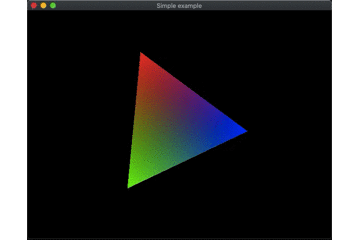
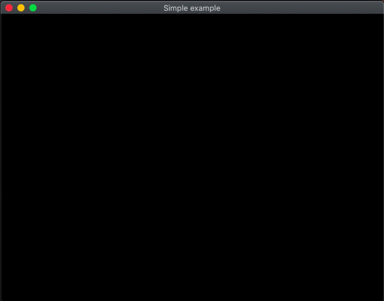
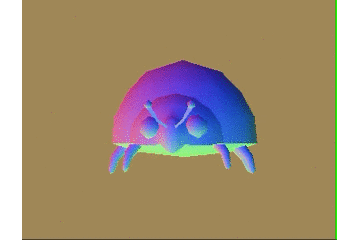
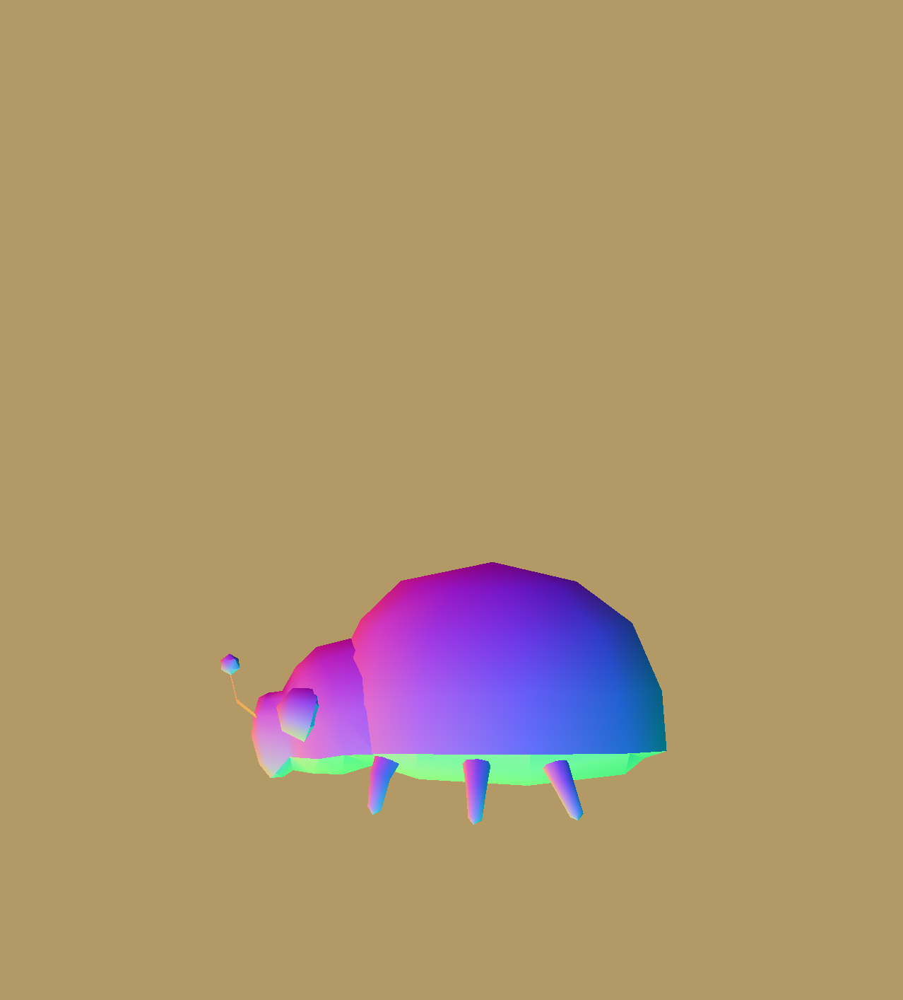

# OpenGL Demo

"OpenGL Demo" is a demonstration of showing object with OpenGL.
Here is the used model throughout this project. (See License)

## DEMO

03_ShowObj is the main project. This project shows the full image of obj file.
3rd stage demonstrated below is the latest version.
  
#### 1st stage ::: vertex
Firstly I showed the image without normal/texture data.  This image is mapped only eith the vertices information.  

 

#### 2nd stage ::: normal
Next step is the shading.  By using normal vector data,  object was added its shades.  

#### 3rd stage ::: texture
Finally, texture has been added to the object by using texture coordinates and the material information in "bug.mtl" file.

### 00_HelloWorld 
Just says "Hello World"

### 01_openwin

### 01_openwinNewGlad

### 02_ShowTexture

### 03_ShowObj

### 04_ShowObjWithShader

### 05_ScreenShot

## Features

These projects use the OpenGL, [GLFW](https://github.com/glfw/glfw), GLAD, stb_image.h, and stb_image_write.h.

## Requirement

* GLFW(3.3.2)
* GLAD(3.3)
* Xcode(11.5)

## Installation

You can install GLFW in [this page](https://www.glfw.org), GLAD in [this page](https://glad.dav1d.de/).

## Usage

Clone OpenGL repository by  
`git clone https://github.com/goto-c/OpenGL.git`  
  
Make build directory in OpenGL.  
`cd OpenGL`  
`mkdir build`  
`cd build`    
  
Use cmake  
`cmake -G Xcode ..`  

You will find Xcode project file in OpenGL/build directory.
Open the project file, then you can try every project.

## Note

I tested environments under Mac, not under Linux and Windows.

## License

https://poly.google.com/view/3WS86lkqYFy

  
  
## references

https://tokoik.github.io/GLFWdraft.pdf  
https://tokoik.github.io/opengl/libglut.html "GLUTによる「手抜き」OpenGL入門"  
